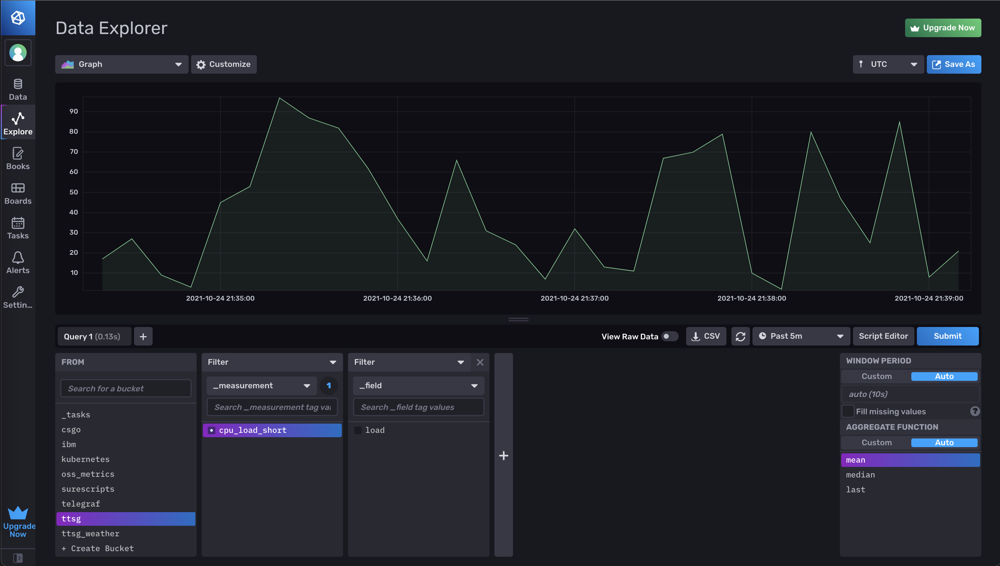

# Line Protocol Generator

This line protocol generator was made with the intention of generating sample data to play in InfluxDB Cloud.

To start to use, you need to change the measurements, tag_key, tag, fields and values to match with the schema that you want to replicate or generate.

Once you going to paste o import the data generated in the file data.txt, you need to select seconds when you specify the precision. 

## Next cool thing

Write directly this sample data to InfluxDB Cloud directly.
